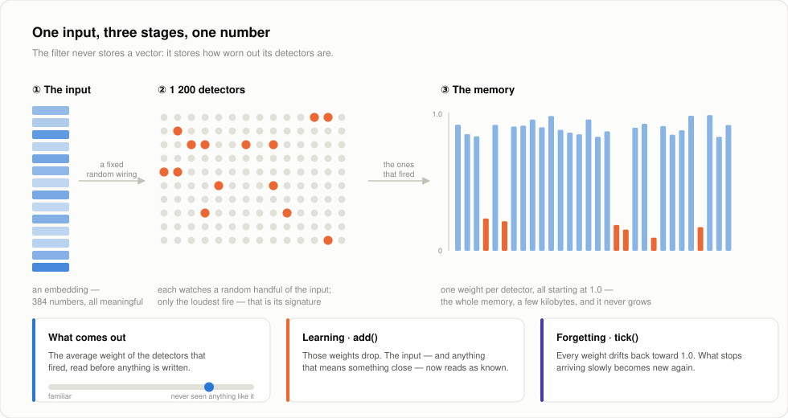
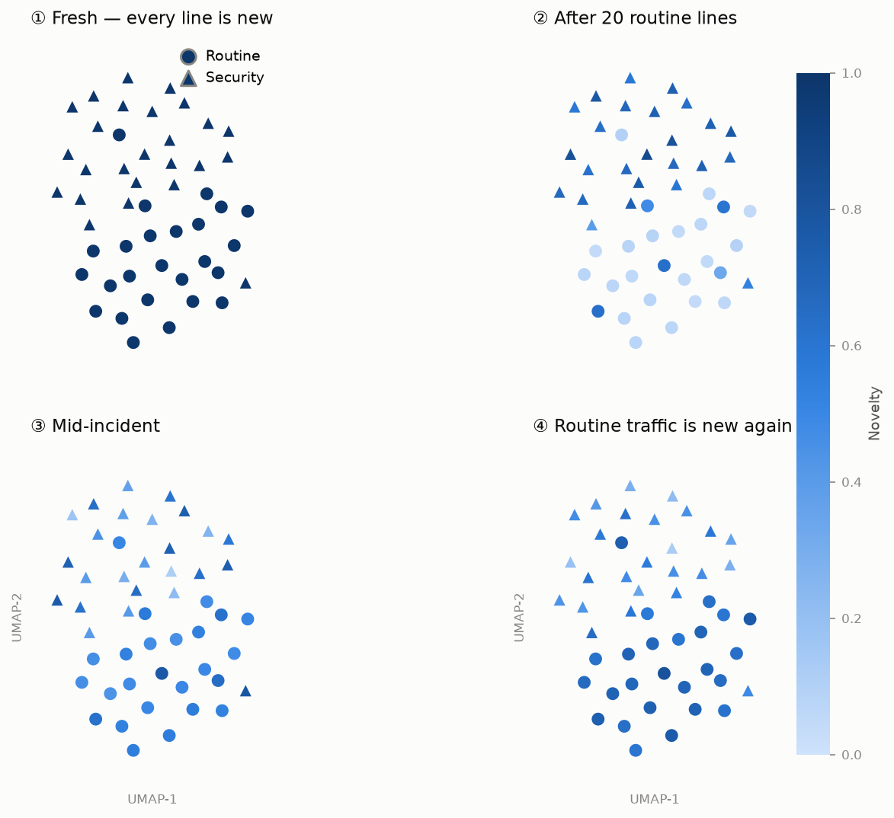
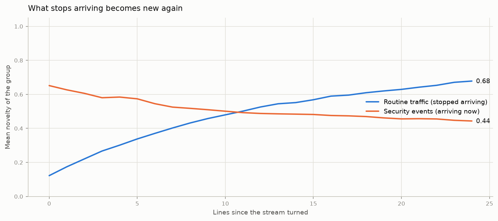
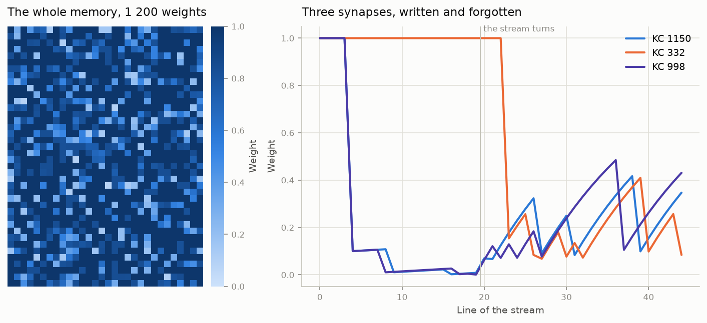

# 🪰 FFBF - Fruit Fly Bloom Filter

  

> *"Have I recently seen anything **like** this?"* - answered continuously, over an endless stream, in a few kilobytes.

A classical Bloom filter answers *is this exact item in my set*. On a stream, that is rarely the question. **FFBF** answers the useful one: it **generalises** - something unseen from a familiar domain is already half-known; it **forgets** - what stops arriving becomes new again; and it does both in **fixed memory**, a few thousand floats whatever the stream length. No training, no labels, one pass.

That combination buys a handful of jobs that are awkward otherwise:

- **Stream monitoring** - logs, telemetry, support queues: flag what does not look like the recent past, with no labelled dataset and no model to retrain.
- **Ingestion and dedup** - drop near-duplicates before an expensive stage (embedding, indexing, an LLM call). *Close enough to something already seen* is exactly what the score means.
- **Cache admission and routing** - a novel query is worth the cold path, a familiar one is not.
- **Edge and embedded** - a few KiB of state, one pass, no backing store, no growth to plan for.
- **Data curation and active learning** - keep the samples that carry something new, skip the redundant bulk.
- **Drift alarms** - because the filter forgets, a regime that goes quiet becomes detectable again instead of staying silently familiar.

It complements a vector index rather than replacing one: FFBF tells you *whether* something is new, not *what* it resembles.

To fully understand the algorithm, I recommend reading the paper which inspired it first: [*A neural data structure for novelty detection* (Dasgupta et al., 2018)](https://www.pnas.org/doi/full/10.1073/pnas.1814448115).

## How it works



1. **Sparse random projection** - the input is spread over `m` detectors (Kenyon cells), each wired to a random handful of input dimensions. The wiring is fixed at creation, so two inputs that mean similar things light up overlapping detectors. That overlap *is* the generalisation.
2. **Winner-take-all** - only the `k` loudest fire. That sparse pattern is the input's signature; nothing else about it is kept.
3. **One weight per detector** - the score is the average weight of the winners, read before anything is written. `add()` pushes those weights down, `tick()` lets every weight drift back toward 1.0.

The whole state is `m` floats plus the projection matrix, sized at creation and never resized. A hundred items or a hundred million, the filter costs the same; what `m` and `k` buy is how many distinct things it can hold at once before they start sharing detectors.

,%20fixed-eb6834?style=flat) 

## See it run

**[Open the bench](https://clembarr.github.io/ffbf-novelty-detector/assets/ffbf-bench.html)** - [`assets/ffbf-bench.html`](assets/ffbf-bench.html), a single self-contained page: the filter ported to JavaScript, sized down to `m = 300` so one synapse is still a visible bar. Send a stimulus and the `k` winners fire, the fibres they read light up, the relief takes the dent, and the score lands against the moving baseline `is_novel()` compares to. `delta`, `epsilon`, `k`, the tick shape and the threshold are all live, and three scripted runs walk through the three things worth seeing: a repeat collapsing into its own dent, a stranger spiking, and a memory decaying back to new.

**[`notebooks/ffbf_semantic_demo.ipynb`](notebooks/ffbf_semantic_demo.ipynb)** runs a different stream - one that drifts from one subject to an unrelated one - end to end: an intruder scored live against the moving baseline `is_novel()` uses, the memory watched synapse by synapse, and sweeps over the knobs that matter (how hard one input is written, which memories fade first, how far back the threshold looks). `python notebooks/_build.py` regenerates it; the figures on this page come from `python assets/_figures.py`.

<!-- The bench is a standalone document because Pages serves it as one. To publish it as a
     Claude Artifact, strip the <!doctype>/<head>/<body> skeleton the host supplies itself:
     `python assets/_artifact.py` writes the fragment to build/. -->

<!-- Capture: open the bench, press `reel ▶` (45 s, captioned, sized to the window), record, then:
     ffmpeg -i capture.mp4 -vf "fps=18,scale=1100:-1:flags=lanczos,split[a][b];[a]palettegen[p];[b][p]paletteuse" -loop 0 assets/bench.gif
     and uncomment the line below.

-->

## Familiarity spreads by meaning, not by item

| Probe, after twenty routine lines | Novelty |
|---|---|
| a line it was fed | **0.07** |
| a routine line it has **never seen** | **0.54** |
| the incident lines, none of them seen | **0.68** |

The middle row is the one a hash-based filter cannot produce: for it, an unseen item is simply absent. Here it lands halfway, because it *means* something close to what the filter already knows - while the incident lines sit above it, even though word for word they are just as technical.



Same fifty lines, placed by meaning, at four moments of the run - position never changes, only the shade does. In panel ② the whole routine cluster goes pale, the five lines never fed to the filter included. In panel ④ it darkens again once the incident has taken over: what a filter covers is a region, not a list, and that region moves with the stream.

## Forgetting is what keeps it usable



As the incident takes over, the two groups trade places and cross around the eleventh line. Run the same stream with forgetting switched off and routine traffic moves 0.07 → 0.08 - **36× slower**. That is the failure mode of a filter whose bits only ever get set: given enough stream, it calls everything familiar. Bounded memory is only worth having if something empties it.

## The memory is the whole state



Left: all 1 200 weights - 4.7 KiB, sparse and mostly untouched - a few dozen carry everything the filter knows. Right: three of them across the run. Two are written in the opening lines and pinned near zero while their kind keeps arriving; the third sits at 1.0 until its feature first shows up, then drops. Once the stream turns, the teeth appear: each drop is a line that fired that synapse, each climb is what it forgets in between, and the spacing measures how often that feature recurs.

## Engineering

 

- **Rust core**, `f32` throughout, four dependencies (`rand`, `rand_chacha`, `serde`, `serde_json`). 53 unit tests, each module tested in place.
- **Fixed footprint** - the weights and the projection matrix are allocated once, at creation, from `m` and `input_dim` alone.
- **Deterministic** - a seeded projection reproduces run for run, and the matrix is serialised explicitly rather than regenerated, so a saved filter keeps behaving identically across library versions.
- **Python bindings** (PyO3 / maturin) that wrap methods rather than fields, plus `ffbf.viz` - the plotting helpers every figure above was drawn with.
- **`Result<T, String>` at the boundary**, so a Rust error surfaces as a Python exception with the same message.
- **Measured, not claimed** - 4 µs per `novelty()` and 7.7 µs per `add()` on a 384-dimension input with `m = 1200`, single-threaded, release build.

## Quick start

```rust
use ffbf::{FFBF, FFBFConfig};

let cfg = FFBFConfig::default_for(128, 1_000);   // 128-dim inputs, ~1 000 expected
let mut filter = FFBF::new(cfg)?;

let input: Vec<f32> = embed("a line of the stream");
let score = filter.novelty(&input);              // ~1.0 on a fresh filter
filter.add(&input);                              // learn it
if filter.is_novel(&input, 1.0) { /* … */ }      // against a moving baseline
```

```python
from ffbf import FFBF, FFBFConfig

cfg = FFBFConfig.default_for(input_dim=384, expected_n=1000)
f = FFBF(cfg)

score = f.novelty(vec)   # numpy array in, float out
f.add(vec)
f.tick()                 # passive forgetting, with decay_mode = EdgeAndFront
```

Build the bindings with `uv sync && maturin develop`.

## Configuration

`FFBFConfig::default_for(input_dim, expected_n)` gives a working configuration; the knobs worth touching first are how hard one input is written (`delta`), how fast the filter forgets (`tick_rate`, `tick_shape`) and how long the adaptive threshold looks back (`window_size`).

<details>
<summary>Every field</summary>

| Field | Default | Range | Effect |
|---|---|---|---|
| `input_dim` | - | > 0 | Input vector length |
| `m` | `30 × n` | > k | Number of KC→MBON synapses tracked (filter memory size) |
| `k` | `m × 0.05` | ]0, m[ | Active KCs per input |
| `projection_sparsity` | `0.12` | ]0, 1] | Fraction of inputs connected per KC |
| `delta` | `0.5` | [0, 1[ | Depression rate of active synapses on `add()` |
| `epsilon` | `0.05` | [0, 1] | Recovery increment of inactive synapses on `add()` |
| `w_max` | `1.0` | ≥ 1.0 | Weight ceiling for inactive synapse recovery |
| `decay_mode` | `EdgeOnly` | - | `EdgeOnly`: activity-driven only; `EdgeAndFront`: also time-driven via `tick()` |
| `tick_shape` | `Lin` | - | Which memories fade first: `Lin` all alike, `Exp` keeps fresh ones longest, `Log` drops them first |
| `tick_rate` | `0.01` | > 0 | Speed of passive weight recovery per `tick()` call |
| `window_size` | `100` | ≥ 2 | Ring-buffer depth for `is_novel()` adaptive baseline |
| `seed` | `None` | - | Fix RNG seed for deterministic projection matrix |

With `EdgeOnly`, weights only ever change on `add()` and `tick()` does nothing. With `EdgeAndFront`, `tick()` moves every weight toward `1.0`: `tick_rate` is a coefficient and `tick_shape` decides what it multiplies - `Lin` a constant, `Exp` the weight itself, `Log` the distance left to `1.0`. So `Exp` gives long retention followed by a fast wipe, `Log` a sharp initial drop followed by a long tail, and `Lin` treats every synapse alike.

</details>

<details>
<summary>Persistence</summary>

The full state - weights, projection matrix, novelty window - serialises to JSON.

```rust
use ffbf::{save, load, to_json, from_json};

save(&filter, "filter.json")?;
let filter = load("filter.json")?;

let json = to_json(&filter)?;
let filter = from_json(&json)?;
```

The projection matrix is saved explicitly, never re-generated from the seed, so a filter written by one version reads back identically in the next.

</details>

---
Illustrative assets, such as the bench and the notebook, have been built with Claude.
